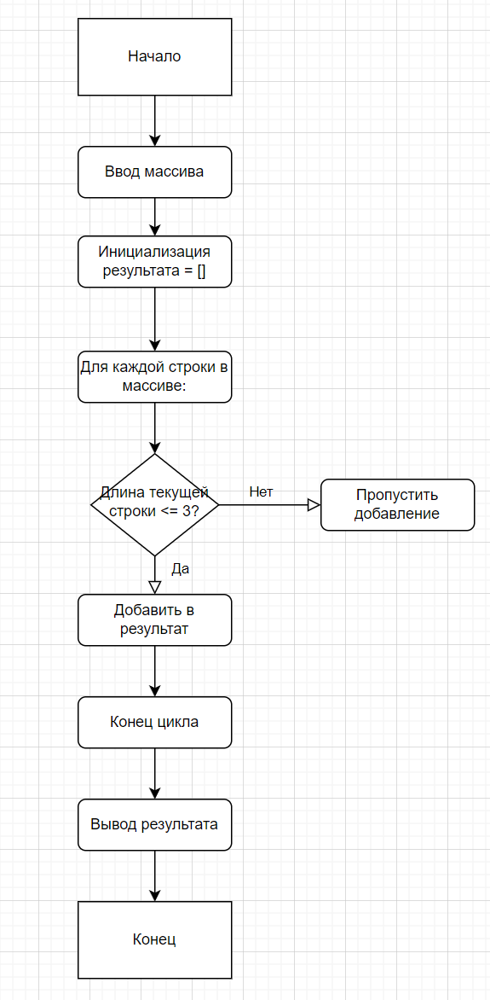

# Итоговая контрольная работа по основному блоку

## Алгоритм

1. **Начало**
2. **Ввод массива**
3. **Инициализация результата**  
4. **Для каждой строки в массиве:**
  5. **Обработка строки**
  6. **Ромб: Длина строки <= 3?**
  - *Да:* Добавить строку в результат
- *Нет:* Пропустить добавление
  7. **Конец условия**
8. **Конец цикла**
9. **Вывод результата**
10. **Конец**

## Блок-схема

